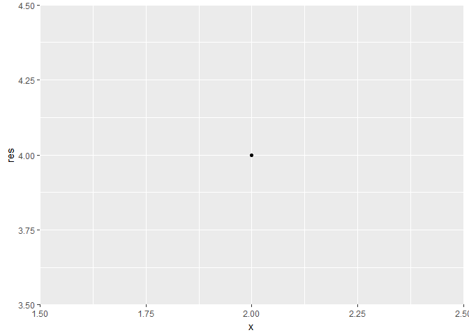

Intro
=====

This R package was built in STAT545 at UBC, and is intended for teaching/learning purposes only

Install
=======

This R package can be installed from github:

-   Note I haven't pushed the final version yet; will update README when I push the final version

``` r
#install.package("devtools")
devtools::install_github("margotgunning/powers")
```

    ## Downloading GitHub repo margotgunning/powers@master
    ## from URL https://api.github.com/repos/margotgunning/powers/zipball/master

    ## Installing powers

    ## "C:/PROGRA~1/R/R-34~1.2/bin/x64/R" --no-site-file --no-environ --no-save  \
    ##   --no-restore --quiet CMD INSTALL  \
    ##   "C:/Users/Margot/AppData/Local/Temp/RtmpuoiAtg/devtools31b84eb17e49/margotgunning-powers-310aef1"  \
    ##   --library="C:/Users/Margot/Documents/R/win-library/3.4"  \
    ##   --install-tests

    ## 

Here's a short example
======================

This can also be seen in the vignette, which I also haven't finished yet

``` r
powers::square(2)
```



    ## [1] 4

``` r
#>[1] 4
```

For development
===============

Not much to say here because this is a learning tool.

There is an internal function called pow that is the machinery for the sqaure function, and functions yet to come ie) cube
